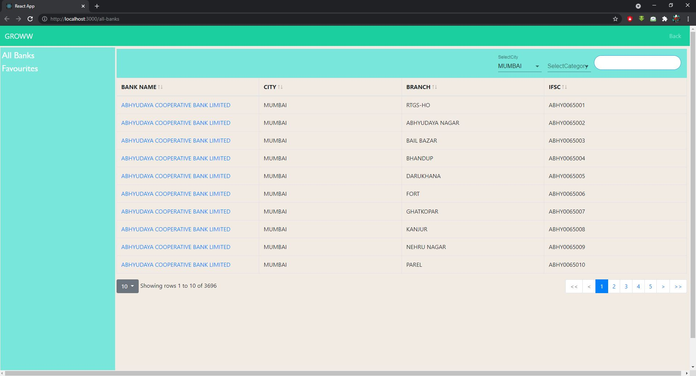
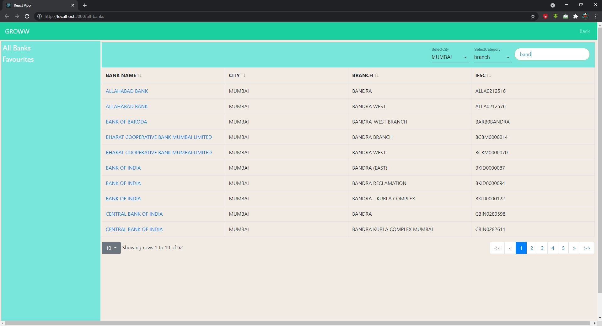
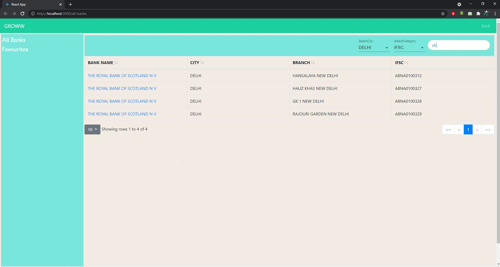
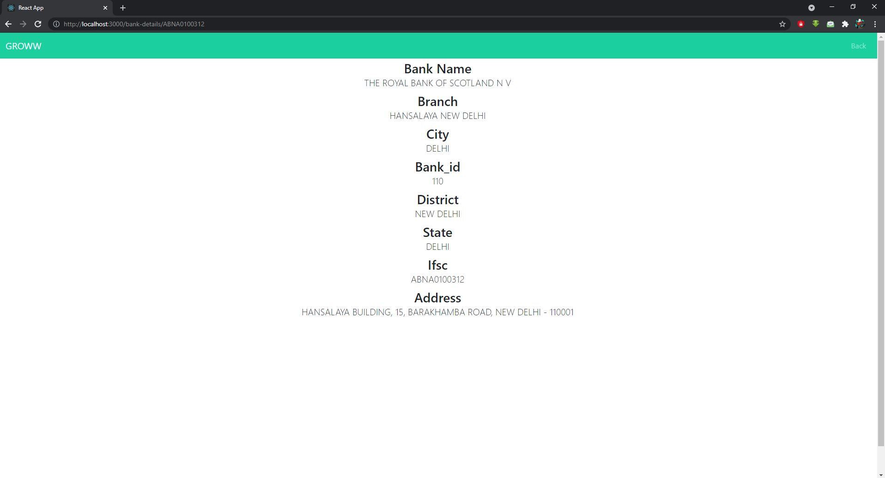

# Getting Started with Create React App

This project was bootstrapped with [Create React App](https://github.com/facebook/create-react-app).

## Use the development Version

-Make sure, the latest version of Node and NPM are installed! \
-Clone the project!\
-Install the necessary NPM dependencies using `npm install`.\
-To start the project, use `npm start`.
-Runs the app in the development mode.\
-Open [http://localhost:3000](http://localhost:3000) to view it in the browser.

## ScreenShots 

